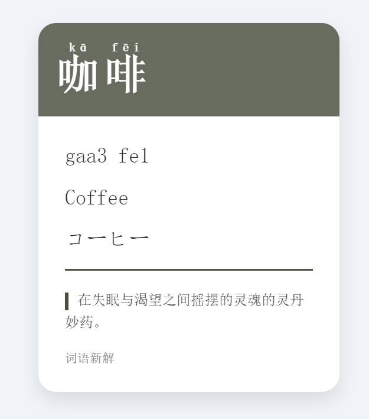

# AI-HYXJ
 
# 汉语新解

汉语新解是一个创新的Streamlit应用，旨在以独特和幽默的方式解释中文词语。它结合了AI技术和文学风格，为用户提供富有洞察力和讽刺意味的词语解释。



## 特性

- 输入中文词语，获取独特的解释
- 汉语拼音、粤拼、英文和日文翻译
- 可自定义或随机选择的Modigliani风格配色方案
- 响应式设计的词语卡片展示

## 安装

1. 克隆仓库：
   ```
   git clone https://github.com/ByronLeeeee/AI-HYXJ.git
   cd AI-HYXJ
   ```

2. 安装依赖：
   ```
   pip install -r requirements.txt
   ```

3. 打开`.env`文件，并添加以下内容：
   ```
   # OpenAI API
   API_KEY=''
   ENDPOINT=''
   MODEL='' # Azure OpenAI可以不填
   ```
   或
   ```
   # Ollama API
   API_KEY='ollama'
   ENDPOINT='http://localhost:11434/v1/chat/completions'
   MODEL='模型名称'
   ```

## 使用方法

1. 运行Streamlit应用：
   ```
   streamlit run app.py
   ```

2. 浏览器会自动打开一个新标签页，显示应用界面。

3. 在输入框中输入一个中文词语，然后点击"解释吧"按钮。

4. 可使用侧边栏来自定义颜色或选择随机颜色方案。

## 贡献

欢迎贡献！请随时提交问题或拉取请求。

## 致谢

- 灵感来源：李维刚的Prompt

## 许可

本项目采用MIT许可证。详情请见 [LICENSE](LICENSE) 文件。
